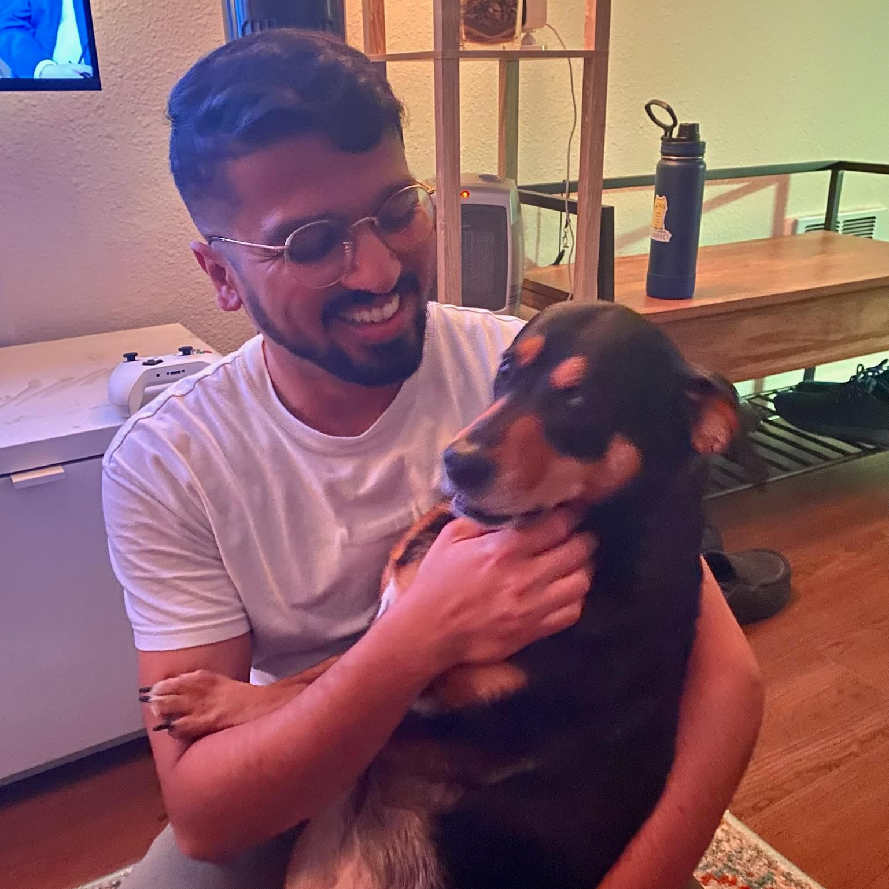

+++
title = 'About Me'
date = 2023-11-30T21:13:20-05:00
draft = false
+++

Hello, I'm Karthik Ramaswamy Padmanabhan, a Bioinformatics Engineer navigating the fascinating intersection of biology and data. Beyond the world of algorithms and DNA sequences, I find solace and joy in a myriad of interests.

In the realm of creativity, I am an avid writer of fiction, often drawing inspiration from the tapestry of personal experiences that life weaves. Words become my brush, and stories are my canvas, allowing me to explore the nuances of the human experience.

When I'm not immersed in the written word, you might find me in the captivating realm of horror movies, savoring the thrill of a good scare. Alternatively, I unleash the competitive spirit within through Xbox games, a world where challenges and victories unfold on a digital landscape.

Living in the picturesque Bay Area, I have developed a deep appreciation for the great outdoors. Whether it's the tranquility of a walk, the invigoration of a run, or the exhilaration of a hike, nature is my sanctuary.

Join me in this journey of exploration, where the realms of science and imagination converge, and every step is a new chapter waiting to be written.