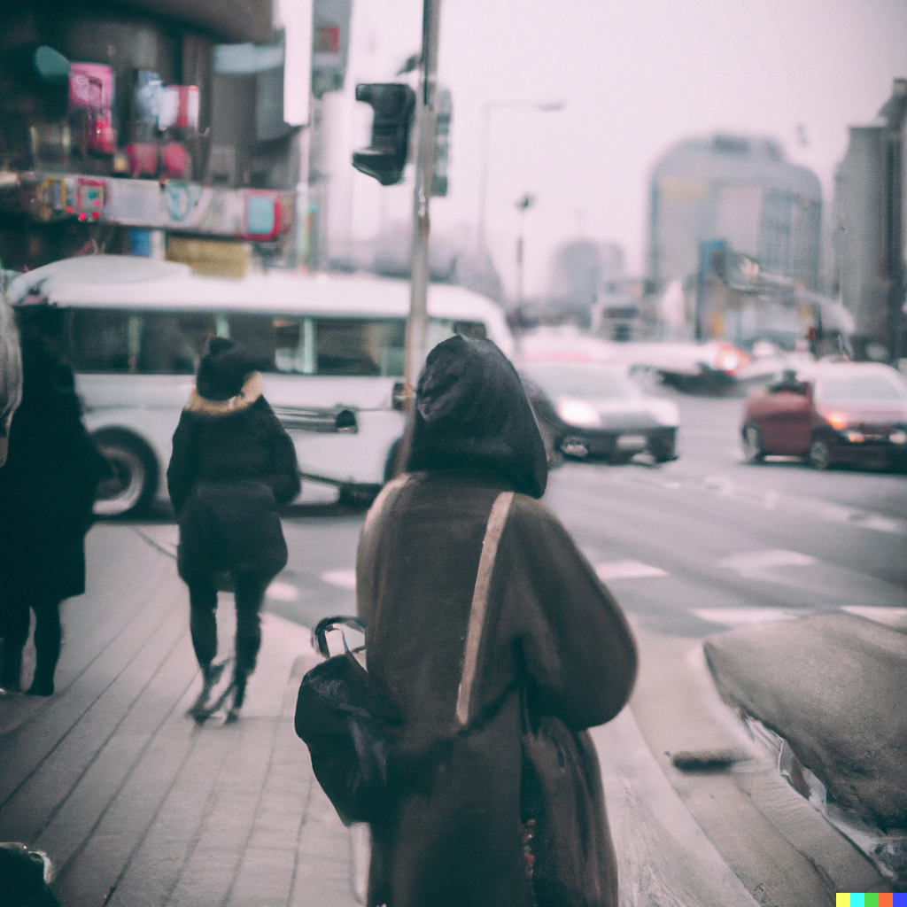

+++
title = 'A Walk Down the Street'
date = 2008-04-22T20:12:41-05:00
draft = false
+++

It was a pleasant evening. The wind was cool and the sun was mild. The usually crowded street was empty except a few dry leaves stained with blood and a couple of empty magazines. Almost all the buildings were in ruins. Some were completely destroyed. She remembered that, not very long back, the street was full of people. Happy people, who were always ready to help others. Very few of them were now alive.

She remembered all the people who had made a big impact in her life so far. The people she could never forget for the rest of her life. How could she forget Asif master, her maths teacher! He was her favorite teacher. His classes were always interesting and often she had wished that his classes would continue the whole day. He made her fall in love with mathematics. She was his favorite student and every time she got the first mark in the class, he would buy her a small gift. When the war was imminent, he had told the class, "Beware of the Americans!! They will kill you once they see you!!!" And kill him , they did. His house was bombed on the first day of the war, since it was close to an army hideout. She could still not believe that he was no more alive.

She kept walking and finally reached her school, or rather, the place where her school once was. The whole place was flattened out by continuous air raids. She fondly remembered her best friend Sameena, with whom she had spent almost all of her school life. They were together wherever they went, and never fought or had a misunderstanding. They had lots of fun playing with dolls, running around the streets, and playing with the stray pups. Sameena loved dogs. She once took a vow that once she grew big enough, she would grow all the stray pups of her town in her house. But she never grew to be big enough. She was killed six months into the war, when her parents were taking her to her uncle's house in Iran, and the bus in which they were traveling was ripped apart by a landmine blast. Sameena's body was never found. She had fever for two weeks after she heard the news.

Tears welled up in her eyes as she walked past the ruins of a building opposite to her school. The ruins were that the shop of Tareeq bhaiya, the most lovable and affable person she had known. Tareeq bhaiya had a stationary shop opposite to the school, and she bought all her stuff from his shop. She loved him so much that she felt as if he were her real brother, and made it a habit to visit his shop everyday, if not to buy anything, just to chat with him. He gave her chocolates everytime she got the first rank in her class. Everyone in the town liked him, because he was always friendly and kind. He was killed after he had saved her from death. She could never forget that incident.

One year into the war, one morning, she was waiting to buy milk at the milk depot since her mother was ill. Suddenly, out of nowhere, a huge fleet of American army tankers and trucks filled the street. People started running helter-skelter and there was confusion everywhere. She was almost caught in the middle of a stampede when someone caught hold of her and started running away from the crowd. She was relieved to see it was Tareeq bhaiya. She was so scared that she hugged him tight all the time until he reached her house.

"Thank Allah that I was there by chance. Else you would have been caught in the crowd. Now go inside and stay with your mother. I have some work to do."

He then kissed her on her cheek and walked away towards the corner of the street. Just as he was about to turn around the bend, a truck, which was coming at full speed, ran over him. He died in front of her eyes, yet she could do nothing. It took her three months to recover from the shock.

It wasn't the only death she witnessed. She had seen three more deaths after Tareeq bhaiya's. But she hadn't known them. She heard of a lot more deaths during the war, most of them strangers to her. Strangers with dreams. Dreams that would never come true. Wishes that can never be fulfilled. Innocent people who committed no sin except being born as a proud Iraqi.

The light slowly started to fade. She realized it was time to go back home. She turned back and started to retrace her steps. As she walked past the ruins, her heart ached for all the people who lost their lives. She prayed to herself that the war should end soon. And there should not be any more deaths.