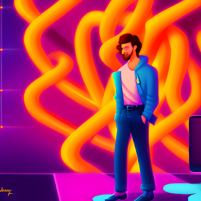

+++
title = 'Finding a Partner in Crime'
date = 2023-03-30T22:26:25-05:00
draft = false
+++

"You gents need some women in your life." I heard Melissa's voice coming from inside the bathroom. "I have not seen a dirtier place in my life."

I turned to look at Santosh, my roommate who was sitting on the other end of the couch in the living room, half in embarrassment, half in amusement. He stared back at me with a similar mix of emotions. We were actually not going to be roommates for long. Santosh was quitting his PhD program and joining Google as a software engineer with a Master's degree. I had been successful in getting a substantial grant approved, which considerably increased my graduate stipend, which meant I could finally afford my own place for the first time in my life. As for Melissa, she was a nice older Hispanic lady who had advertised her house cleaning services on the community notice board in our apartment, and who was now deeply regretting her choice to agree to clean our apartment before we moved out the following week, for a measly sum of $200. Suffice it to say, Melissa received a generous tip that afternoon once she finished cleaning the apartment.

The final days before I moved out were hectic, to say the least. Santosh moved out first, and there was a lot of partying, general merriment, and eventual sadness of losing a friend to physical distance before he boarded his flight to California that weekend. I finished packing up my modest belongings in boxes that barely filled up half a U-Haul cargo van and moved to my new apartment about a mile further away from the university campus. It was definitely a cozy space, but more importantly, it was much more affordable, and it was entirely mine. Unpacking boxes took a day or two between lab work and research, and after a few trips to Target for some new apartment essentials, I was fully set up in my place a week after Melissa's comment about the lack of a significant other in my life. Melissa was not the first to point out that fact either. My friend and lab mate Henry had been trying to convince me to sign up for a dating app for at least a year. But between my long hours in the lab, teaching assignments, and coursework load, I never had the time to even think about dating.

"But that was your second year! They are always the most intense. Now that you have the fellowship, you don't have to teach anymore. Plus, no more coursework either." Henry tried to reason with me with fairly strong points after I confided in him about Melissa's remark a few days later and whined about the lack of time for companionship.

"Yes, but who would want to date me?" I grumbled back at him, exposing my utter lack of self-confidence.

"Dude, you are solid! If I wasn't already married with kids and about a decade older than you, I would totally date you." That was Brittany, another friend and lab mate of mine who had apparently not been as preoccupied with her work in the lab as I had imagined her to be. Some independent sources state that I visibly blushed upon hearing that remark, but I can neither confirm nor deny those rumors.

A few more minutes of discussion and arguments regarding this topic followed among the three of us, and in the end, I was almost forced at gunpoint to install Bumble on my phone. The next couple of hours were spent very productively setting up my personal profile, with constant debates regarding the suitability of certain prompts and the attractiveness of my pictures. Other lab mates walking in and out of the office space occasionally joined in the critiquing process. By the end of that workday, I had a pretty complete dating profile.

"Now all you have to do is start swiping on profiles. Once you match with someone, the girl has to message you first before the match expires in 24 hours." Henry was teaching me how the app worked. "Start with a few right and left swipes, and see who matches with you."

After heading back to my new tiny apartment and wrapping up a ramen dinner, I opened Bumble again on my phone with much apprehension. On my screen was the profile of a girl named Liz. She looked cute. Scrolled down a bit more. She liked running, hiking and guys with a good sense of humor, so I thought I had a good shot. Swiped right. Another profile popped up. Priya. Also a PhD student at the university. Looked attractive. Vegan, super into yoga, skiing and cocktails. Not really my kind of activities. Swiped left. On came another. A gorgeous girl named Harini. Interests included biking, board games, running and eating out. Pretty solid overlap. Swiped right. Rinse and repeat for an hour before going to bed.

I woke up much later than usual the next day, and hence, did not check my phone for missed overnight notifications until it was late morning and I was already in my lab. Among the many unimportant Twitter, Instagram, and Gmail notifications were the ones from Bumble. I had 4 matches, and 3 new messages. I could feel my pulse racing as I opened the app. The messages were from the two I mentioned previously - Liz and Harini, and one another girl - Sandra. The first two had sent generic "Hey!" and "Hello!" messages. Sandra had gone a step further and commented specifically about my love for horror movies. I liked her better already.

I will be honest and admit that that particular Thursday was not a productive workday. I started chatting with all three of them at the same time, and I realized I was finding it extremely easy to connect with all of them. Liz was starting her senior year as an undergrad studying biochemistry. Harini was trying to get into law school, and Sandra was in grad school studying to become a therapist. I was great at banter and the dad jokes, and by that evening, each one of them had separately messaged me their phone numbers asking me to text them directly. After dinner that night, I had asked them out on dates - Sandra for coffee on Saturday morning, Harini for dinner on Saturday evening, and Liz for drinks on Sunday evening. Now it was time for me to panic.

I was panicking because I had no idea what I was doing, even though I must have been doing something right to get three dates in the first week. And that was because I had never actually dated someone in the US yet. I had been on a couple of dates, if you could even call them that, with a girl in college back in India. But I hadn't felt a spark with her, and we ended up parting on friendly terms. I texted a couple of friends for advice - Henry and Dinesh, the only friend I knew who had a partner he had met through dating apps. The counsel I got from them was pretty similar - just be yourself, have fun, and offer to pay for the food/coffee/drinks. Wear comfortable clothes and shoes, and consent is important before any physical contact such as a hug or a kiss.

Friday came and went like a flash, and it was yet another unproductive day. The texts were flowing, albeit more freely with Sandra than the others. I felt like I was on one of those dating reality shows on Netflix - I had to keep track of each person's conversations: likes and dislikes, the level of flirting that they were comfortable with, what part of my life I had shared with each person so far, and so on. It was honestly exhausting because these were three extremely smart and witty women, and I had to spend a ton of mental energy to keep up with all of them. So even though it was a lot of fun, I decided that after my first dates that weekend, I would rather focus all my energy on one of the three girls if we liked each other.

Saturday's weather was a bummer. It had been raining all Friday night, and it was still pouring down that morning. I was supposed to pick up Sandra at 10 am from a bus stop near her apartment since she didn't have a car. She had been weirdly curious about what car I drove, but I chalked it up to pre-first date nervousness and an attempt at small talk. I was not looking forward to walking around in the rain, or alternatively, sitting inside a crowded coffee shop trying to hear each other over music that no one would ever hear outside of tiny coffee shops. Trying to come up with alternative locations for the date, I suddenly remembered that I had been given a membership to the science museum by Santosh as a parting gift. "Use it wisely," he had said in his gift message. Well, what wiser way to use it than to take a girl out on our first date on a rainy morning? Thanking my brain for being useful for once, I texted Sandra to check if she would be okay to meet at the museum instead of the coffee shop like we had originally planned. The response was not too enthusiastic, which was mildly concerning, but she was still okay with the change in plans.

Nervousness and anxiety were the top two things I would describe as feeling as I pulled into the bus stop to pick Sandra up. She was already waiting for me when I pulled in, which I was not surprised about since she had mentioned in her dating profile that she liked being on time for all her commitments. She was wearing a light blue floral summer dress, her face glowing with a bright smile as we made eye contact for the first time, and I was suddenly feeling very hot and sweaty despite the cold and dreary weather. I waved at her as she walked towards the car, her golden hair glistening in whatever sunlight the dark clouds had let through that morning. She settled down in the passenger seat of the car and gave me the opportunity to get a closer look at her beautiful blue eyes, subtly reflecting the blue from her dress. We hugged each other while exchanging pleasantries, and I started driving to the museum, half blushing and half melting.

The chemistry we had over texts appeared instantly when we started chatting in person too, and we utterly enjoyed being in each other's company, spending over five hours inside that tiny museum just talking. Scientific exhibits were walked past many times without even being glanced at, multiple coffees and snacks were purchased and consumed at the museum cafe, flirtatious conversations flowed, jokes were cracked, embarrassing personal and family stories were exchanged, and multiple occasions where loud laughter could be heard echoing around the museum chambers. At the end of the date, we hugged and briefly kissed while I was dropping her off at her apartment, and she promised to text me with plans for our second date soon. I drove back home, asked ChatGPT to create a text message for me with the prompt 'How do I politely cancel a first date with someone since I feel like I already met my soulmate?' and sent the response to both Liz and Harini, adding a personalized apology to the texts as well.

"Is it ok if I already feel attached to someone after our first date?" I texted Henry once I got home that evening. I then described the details of the day's happenings in subsequent texts. 
"That does sound like an amazing first date, dude!" was his reply. "Be wary of love-bombing, but don't overthink it, and go with the flow. So happy for you!" he added.

So with the flow, I went. We texted back and forth constantly over the next two days between friend meetups, grocery store trips, and laundry loads, gushing over how much we liked and missed each other. On Sunday evening, Sandra finally asked me out on a second date, wondering if I minded just coming over to her apartment the next evening and watching a horror movie after a take-out dinner, to which I readily agreed. "Sounds like a perfect evening!" I remember texting her.

Monday morning was a blur. I briefly remember waking up, being physically present in my lab, and doing something that resembled work but don't recall anything else that happened. My memory of that day starts that afternoon when I finally got back to my apartment, showered, changed into clothes more appropriate for a date night, and headed over to Sandra's apartment a few minutes away by car. As she let me into her apartment, I noticed she was dressed more casually that evening, opting for a blue flannel shirt and black jeans, still looking absolutely incredible. We kissed, more passionately this time, and settled down to munch on pizza and breadsticks. I don't even remember what we were talking about, I was lost in her eyes, and caught myself shamelessly ogling at her a couple of times. But something felt off about her that evening. She kept repeating some things she said a couple of times, seemed to have forgotten some conversations we had on Saturday morning, and her movements seemed kind of robotic. Maybe she is a little bit stressed out, I thought to myself.

"Let's move to the couch!" she said with a smile as we finished dinner. "I already purchased the movie on iTunes so we can just start watching it."

We sat on the couch close to each other while she switched the TV on. I turned to look at her gorgeous face up close, but what I saw was a face wearing an unnatural smile. Sandra turned her face towards me, her eyes glassy and expressionless, and her mouth stuck on the same smile, almost as if she was glitching. Then she opened her mouth to speak.

"Thank you for using SANDRA - Scam Artists National Division's Robot AI. Hope you have a pleasant evening. Goodbye!"

I watched in horror as the eyes and mouth on her blank and robotic face closed, and her head fell back on the couch, almost as if she/it was dead. What the fuck is happening? Then the TV started playing something.

"Hello! We have been trying to reach you regarding your car's extended warranty. Our records indicate that you have a 2020 Chevrolet Equinox..."