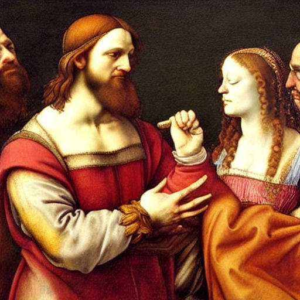

+++
title = 'First Love'
date = 2008-05-18T04:19:06-05:00
draft = false
+++

Love was something that never appealed to me. Since the time I entered college, people all around me were falling in love. I thought it was all stupidity when people described love as divine, everything in life. Every time when I heard of some guy who had committed suicide just because his love wouldn't accept him, I felt as if I should go and slap him in heaven or hell, wherever he is. How the hell he forgot his parents, who were alive only for him to succeed in life?? In a nutshell, I loathed love, and once even swore to my friends that I will never fall in love in my life. All this was true, until I saw her.

She was not the prettiest girl in the college. She didn't have loads of guys behind her. She wasn't the most popular girl in college. But she was beautiful. One look at her face and it made me forget the whole world, and I felt as if I should go and hug her. Before she was known to me, I never made any attempt to groom myself properly. My hair was always unkempt, and I wore clothes that were shabby and loose-fitting. But I changed myself completely. I cut my hair to the bare minimum (used to have long hair), wore smart clothes (loaned from my roommates) and for the first time in my life, used a deo. My friends were amazed at my make-over. I even noticed girls glancing at me, and my parents were happy when I went home the next time that finally their prayers had been answered.

I used to wait in places wherever she frequented- temple, canteen (during the interval times), the college bookstore, and all other places (except the girls' toilet, of course). But somehow I never got the guts to talk to her, or even approach her. I just used to stand and watch her go by. My grades dipped to a new low, because most of the time was spent in either thinking about her, knowing about her, or hatching up plans to talk to her. The more I thought about her, the more crazy i became,and the more I fell in love with her. I managed to get her mobile number from one of my friends, but didn't dare to call her or even text her. My friends dismissed me
as a lost case.

Then, the day I can never forget in my life, arrived. It was Friday, a day she went to the temple after classes were over. As usual, I was waiting under the same tree near the entrance of the temple. She strode towards the temple with elegance, and once again I felt as if I was in heaven. I forgot what was happening around me, as I watched her smiling, laughing and chatting with her friends. Suddenly, she looked straight at me. Her friends stopped near the temple, while she passed the temple and came straight in my direction. For a moment, I thought she was coming to talk with me, but what happened next was unbelievable.

She walked to a thin middle aged woman standing outside the temple and hugged her. When I watched closely, I realized that it was my mom! They started talking to each other as if they were mother and daughter. My mom kissed her on her cheek, and then I noticed something else. Our car was standing in the parking area adjacent to the temple, and my dad was coming out of it!!!

I couldn't comprehend anything of what was happening. I decided to come out of my hiding place and ask an explanation from my parents directly but before I could move, they had gotten into the car and bolted out of the college. I was confused, and went back to my room. May be they figured out that I was in love with the girl and had already fixed an alliance with her parents?? Impossible. I thought of calling my mom on her mobile, but decided against it. I decided that I should talk to her in person. I knew that for the girls, the hostel in-time was six-thirty pm. So I figured out that they should be back within that time. I walked back to the entrance, and sat on a bench. Time passed, and it was almost time. It was then I noticed the dark green Matiz entering through the gates. It went past me and into the road that lead to the girls' hostel. I waited near the gates for the car to come back. And before long, I saw the headlights of a car coming down the road. I stood in the middle of the road, and signaled the car to stop. The car stopped, and my mom got out of the car.

"Karthik!!" she exclaimed.
"Mom, you have got some explaining to do. Who is that girl?" I asked her as soon as she came near me. My dad came out of the car and stood near me with an expressionless face.
"We're sorry, my dear child. We should have told you this before, but we thought we could tell you once you finish college."

I didn't know what to expect. May be they had really fixed an alliance? My heart started beating rapidly. I waited for the next words to come out from her mouth.

"This will be a little hard for you to digest. Take it slowly. You are not the only child to me. I had twins, a boy and a girl. You are the boy, and the girl is Swathi, the girl you saw us with."

It was like a bolt from the blue. I couldn't believe my ears. I wondered if it was some April fool prank, but April was months away. I just listened to her as she continued.

"When you both were born, we didn't have enough money to raise two children. So we decided to give away the girl child to one of your dad's friends who didn't have a child for many years. We knew it was foolish, but we didn't have any other option then. We thought that once we came to a good position, we could take her back, but by then, she had grown attached to her new parents, and so we couldn't bring her back. But we followed her studies in school, paid her fees, and made her join college. Unfortunately one day, she accidentally overheard your dad's friend and his wife talking about us, and discovered the truth. This happened when you were in first year. We had never wanted both of you to study in the same college, but both of you had no other choice, and by fate, you both joined here. After that, we made frequent visits to meet her, and made sure that you never noticed us. But today you saw us somehow."

I was shattered. Things started happening quickly afterwards. My parents went back to the hostel and brought Swathi outside. They told her who I was. Though she knew she had a twin brother, she was never told anything about me, nor shown my picture. After all the flash backs were over, there was complete silence. I wanted to ask Swathi many things. Were you also seeing me like I did? Did you know that I was in love with you? Do you love me? Thoughts were flying across in my mind when suddenly, she came near me and smiled at me. I smiled back stupidly. I wondered what she was going to tell me when she opened her mouth to talk to me for the first time.

"I love you....my brother!!!"