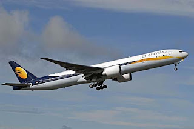

+++
title = 'Game Over'
date = 2009-08-15T22:05:32-05:00
draft = false
+++

"Welcome to Indianapolis!", the driver announced as the shuttle entered the airport. Though it was the second time I was going to Indy, something about the place looked unfamiliar to me. Maybe it was the weather? I didn't know. It was kind of chill and foggy when I got down from the shuttle. There was the scent of rain, but I hoped it wouldn't rain, at least not till I get back inside the safety of my apartment.

I walked towards the exit gates of the airport. The bus stop was a little further away. I had been told that a bus arrives exactly at 12.30 pm, so I figured out I would have at least ten minutes before the bus arrived. My mind started wandering towards the happenings of the last two weeks. Everything had been a blur. I wondered for the umpteenth time whether I was living in a dream, and when I wake up, everything would vanish. But I knew without pinching myself that I was indeed in reality. And I had some serious work to do.

Everything had started during my flight two weeks back. I was excited about traveling in a jet, because I had never been air-borne before. Add to it the excitement of a new place, new country, and new-found freedom, and you have got a hyper-excited guy. It was supposed to be the beginning of an important phase in my life. A ticket to all my dreams. Higher education in the United States. The first leg from Chennai to Brussels had been smooth. I got a window seat, and there was this pretty Indian girl sitting next to me. There was a mutual unspoken understanding, which meant we ignored the existence of each other. I tried not to sit too close to her, as much as possible, and she tried the same too. No problems whatsover. I was perfectly fine with the arrangement.

Trouble started during the second leg of the flight. After a one-hour stop at Brussels, it was hardly fifteen minutes after take-off towards New York, when she puked on me. It was so sudden. I didn't know what to do. I kept staring as she kept on vomiting on my shirt and my brand new pair of jeans. I tried to react by avoiding the path of flow, but it didn't help. In the matter of seconds, my clothes were ruined. She looked at me with a look I could only classify as apologetic. I still didn't know what to do. She spoke first.

"I am so sorry. I don't know, I have been feeling sick for the past two days, and now this turbulence during take-off. Before I had time to control it, I just vomited. I am extremely sorry."

I kept glaring at her. But the gentleman I was trying to be I told her, "It is okay. Are you feeling okay now? Do you need medical attention?"

"Oh no, I will be fine. God, look at how badly I have soiled your clothes! I am so sorry! I feel so bad I did this!" she moaned.

Actually she looked kinda cute when she said that. But I tried not to show any emotion. I just said, "No it's alright. I have a couple of tees and some pairs of jeans in my cabin bag. I guess I will just change and come." Saying that, I stood up and tried to retrieve my bag from the overhead compartment. I felt that a lot of people were looking at me. But I tried to ignore them, and concentrated just on taking my clothes from the bag. When I finally managed to do it with some help from the girl, I rushed to the rest room and changed. My clothes were stinking from all that liquid.

It took me ten minutes to change my clothes and come back out of the restroom. Some people were still staring at me. I still kept ignoring them. I occupied my seat and looked at her. She still looked miserable. I tried to dump my clothes inside my bag, and after much effort, managed to do so. I settled down in my seat and she opened her mouth to speak.

'My name is Krithika." she said, as she offered a handshake.
"Oh, nice name. I am Karthik." I accepted her friendly gesture.
"Are you going to IUPUI too?" she wanted to know.
"No. Actually I am going to IUB." I noticed the disappointment creep into her face as I said that.
"Oh, good. I wanted to apply there, but I missed the deadline." she explained.
"That is bad. But IUPUI is a good university too."
"Not as good as IUB though." she added before I could finish.

And there it started. We spoke as if we had been friends for long. The talk started with university rankings, admits and rejects, and other academic stuff, and slowly moved on to hobbies, parents, and personal stuff. We had talked to each other for almost 2 hours, and I felt I almost knew her entire life history, and I had told her mine. An old lady sitting in the front row was glaring at us because I guessed she couldn't sleep. I ignored her looks. Anyway, both of us felt tired after the long talking session, so we decided we needed some sleep. And we fell asleep soon after.

By the time I opened my eyes again, she was awake already. I drowned in her eyes as she said a "Hi" with the same cute smile. I smiled back sheepishly, rather sleepily. She was watching something on the personal entertainment system. I leaned forward to see what it was.

"Rock on." she whispered before I could recognize the scene.
"Oh, nice movie." I replied.

Bored, I started watching some old tennis matches. Before long, a voice in the PA system announced that we were about to land in New York. Ah, finally after so much preparation and struggle, here I am, at the United States of America. A huge sigh of relief. Little did I know, that, two weeks later, I wouldn't be so relieved after all.

"We are here, at last. In the USA." she said to me and smiled. The same cute smile.
"Yeah." I smiled back.

Once inside the JFK airport, we had to change flights, from a Boeing to the much smaller Embraer jet. Unfortunately, we couldn't get seats next to each other. She seemed more disappointed than me due to that. I had mixed feelings, since this time, it was a hot American chick sitting next to me. I was hoping to somehow start a conversation with her during the flight. She had to sit next to an old lady who kept asking her where she came from and whether all Indians are vegetarians. She kept turning back to look at me helplessly, but stopped when I started giggling uncontrollably every time. She was probably pissed at me for not having tried hard enough to convince the old lady to shift to my seat, so that we could sit together.

The flight landed in Indianapolis soon after, at around 11 pm local time. She glared at me when I walked towards her so that we could gather the baggage together. May be she did notice that I was chatting away happily with the American chick (Sarah was her name, by the way) while I left her to suffer in silence. I offered the biggest and most stupid smile I could manage, and hoped it would work.

"So, a busy flight eh?" her voice was stern, almost authoritative.
"Hmm no. But at least it was more interesting than the previous flight. And a much hotter girl." I grinned.
"You %&$*!@ (insert the worst expletives here) !!" she started off, but I knew she was floored.

We collected all our baggage and sat in one of the couches inside the airport. Being midnight, there was no transportation in and out of the airport. So we had to wait till the first taxi in the morning to go to our respective apartments, her's in Indy and mine in Bloomington. I opened my laptop and was pleasantly surprised to find a free wifi network. So I started replying to all mails and facebook messages that I had got during the two days of my internet deprivation. She hadn't brought her laptop from India, and thus sat opposite me, trying hard to sleep.

"Enough with the internet, jerk. I am bored." she quipped suddenly.
"I thought you were sleeping." I offered an explanation.
"Not able to sleep. Let us do something interesting together."
"Ya? Do you want to play NFS Most Wanted? Or FIFA? They are the most interesting things I have come across." I gave her two options.
"You know what? I am actually glad that you are going to be in Bloomington, and I am going to be in Indy. You are such a jerk." she gave up on me.

And there it started. Just when I thought I had told her my entire life history, and she had told me hers, I was proved wrong. We kept talking, for hours. After close to four hours, she finally got tired of talking and without any notice, lied down on my lap and dozed off. *Careful, careful. Don't jump to any conclusions yet, Karthik. Not yet.*

Morning came soon enough, that meant she had to catch a bus to Indianapolis, and I had to take the shuttle to Bloomington. In other words, it was time to part. As much as I tried not to feel sad, I couldn't help it. Though we started talking due to a mishap, we got along so well that we couldn't believe we had known each other for less than a day.

"Are you on Orkut?" she wanted to know.
"Who uses Orkut nowadays? I moved on to Facebook like a decade ago." I quipped.
"Oh what is Facebook? Is it similar to Orkut? Or is it like Yahoo Messenger?" she asked.
"Wow I can't believe you are so behind in technology. No one uses Orkut these days. Nor do people use Yahoo Messenger. It is all Facebook and Google Talk now."

So after a short, two-minute long lecture on the latest trends in social networking and instant messaging technology by me, we exchanged email ids. I promised to send her my mobile phone number as soon as I could, and so we parted with sadness writ large on our faces.

"Don't miss me too much." I said jokingly as she got into her bus, but deep inside my heart I knew I would miss her a lot.
"Ya right. Dream on." she managed to smile, as the doors closed and the bus started to leave the airport. I kept looking in her direction till the bus disappeared from sight, and I was sure she would have done the same too. Soon after, I was on my way to my apartment in Bloomington, thinking about how my life was going to be at a new place, with new people around me.

A couple of days passed. I managed to settle down in my new environment, new roommates and all that. We managed to have Comcast install a new internet connection, and I got myself a cheap Nokia on an AT&T connection in one of my seniors' family plan. As soon as I opened my inbox I saw that it had close to a hundred unread emails, but I immediately found the email which I really wanted to see.

>Jerk,
>
>Got myself a phone. Call me at xxx-xxx-xxxx. Miss you.
>
>Krithika

I reached for my phone in such a swift move that my roommates thought I had a paralytic attack. I called her. Somehow she knew it was me on the phone, even though I hadn't sent her my number yet. It was such a magical feeling when I heard her voice again. I felt like a hundred unicorns were circling around me, and a thousand flowers falling all around me. It was as magical and revolutionary as the original iPhone. I hadn't missed anyone that much in my life before. And I told her that. She told me she felt the same. We spoke for hours, yet it felt as if we spoke for hardly a few minutes. I can't even remember what we spoke about, but I couldn't care less. Yes, I was in love.

A couple of weeks passed. I kept talking to her on the phone so much, that I hadn't bothered to go out and look for part-time jobs while all my other friends were already employed. I was absolutely certain that she was into me as much as I was into her. I think she once mentioned to me that she hadn't taken a shower in 48 hours since she spent most of that time talking to me, but I am not quite certain.

It was a Sunday morning when I received the email. It was around 9 in the morning and I was wondering why she hadn't called me yet. I was still lazing around in bed, when I casually opened my inbox to find an email from her. It had been sent to me 4 hours earlier.

>Karthik,
>
> I want to tell you so many things, but I need to tell them to you in person. I am in a very bad state right now, so don't try calling me. I will not answer your calls. Meet me at the following address at 2 pm today. I will tell you everything. If I am not there at that time, please call the police and report me missing immediately. Please hurry.
>
> 135, 7th Main St,
> Woodburnton. Indianapolis.
>
>Love,
>
> Krithika

My mind was blank when the bus I had to board arrived at the bus stop inside the Indianapolis International Airport. I boarded the bus, and occupied a seat nearest to the exit. Being Sunday morning, the bus was almost empty, except for a couple of other people. I didn't mind that. I needed the loneliness and space. I was too numb with fear and anxiety to think about anything. I felt like I was about to explode. That is not to say that I hadn't thought about a logical explanation behind the email I got from Krithika, and what could have happened to her for her to send such an email. But I tried not thinking about it again since all the scenarios that came to my mind ended with either me getting killed or her getting killed. 

After I got the mail, I barely had enough time to check out the address on Google Maps and to figure out how to get there. Unfortunately, it didn't occur to me until after I boarded the bus that I could have actually checked out the building using Street View. The bus ride took about 40 minutes, and I got off the bus at the stop nearest to the address. It was a 10 minute walk from the stop to the address in the email. As I started walking, I took in as much information as I could about the neighborhood. It wasn't particularly crowded, but more importantly, it wasn't empty either. It was mostly a residential neighborhood, with a few seven or eight-story buildings here and there. I could feel my heart beating increasingly faster as I got closer. 

I finally reached the address. It was a house, a really small one at that. There were no cars in the driveway, and the lawn looked like it could use a mower. But I could see signs of inhabitancy inside the house through the windows. I was in half a mind to break in to the house through the windows, but I thought it was better to knock on the door first. And that was exactly what I did. 

*Knock knock knock.*

I waited and tried to hear footsteps, if any, coming from the other side, but I couldn't. A few seconds passed. No answer.

*Knock knock knock knock.*

I knocked harder. Now I could hear movement from inside the house. And I could distinctly hear footsteps coming towards the door. I tried to prepare myself for the unknown entity to open the door. I suddenly had a distinct feeling of being watched through the peephole in the door. The door opened. It was she who had opened it.

"Krithika, what happened to you? What is this place? Why are.."
"Just come in, Karthik." she interrupted me. "Just come in, and I will tell you everything." Her voice had an eerie feel to it.

I entered the house into what seemed like a living room. It was dark, so I really couldn't see anything.

"Do you remember the date we first met, Karthik?" she asked me, in a soft, mellow voice. Her voice was really creeping me out. It sounded very much unlike her usual bubbly, cheerful voice.
"Yes, of course. It was the 14th of August. Now what does that have to do anything?" I wanted to know.
"And how long have you known me?" 
"Err, around two weeks. Come on, now...."
"Happy birthday, jerk!" she exclaimed, and at the same instant, turned on the lights, and in the middle of the room, was the biggest cake I had ever seen in my life. There were balloons all over the room, and on the cake were written the words 'Happy birthday love!". I had been involved with this stupid girl so much for the past two weeks that I had even forgotten my own birthday. I had lost track of time.

"What the f&*% is all this?" I didn't know if I was angry, happy, relieved or a combination of all three. 
"You don't even remember your own birthday, do you?"
"But, was it really necessary to scare me like this? Don't talk to me ever again!"I was kind of pissed. 
"Awwww, my baby is all angry now." she said in a cuddly voice, and put her arms around me, and gave me that perfect, cute smile. My heart had already began melting.
"I love you." I blurted out. "I love you with all my heart."
"Sshh, I know, you jerk." She put her finger on my lips. I looked into her eyes. I could see the universe swimming inside them. Subconsciously and slowly, our lips started approaching each other. I knew it was going to be the most beautiful kiss ever. 

"Dude!" suddenly I heard my roommate, Suresh's voice. I looked around. I realized I was sitting inside flight number 9W 226 from Brussels en route to JFK, and Suresh was sitting right next to me. "Dude, wake up. It is time to get off the flight." he said.