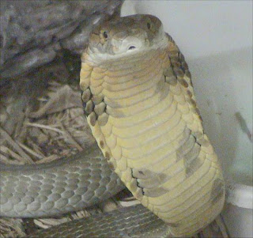

+++
title = 'I am a Snake'
date = 2009-01-15T21:41:20-05:00
draft = false
+++

My pleasant salutations to all the human beings out there. My name is Raven, and I am a King Cobra. Yes, I am a snake.

For all those intelligent humans out there who think we snakes cannot communicate, I am here to prove all of you wrong. We may lack a ear to hear stuff, smell through our tongues, and may lack the ability to talk in various languages like you humans do. But we can still communicate, and it is by far the best mode of communication that any one of you can even imagine. But I will come to that later.

I was born as one among many children to my lovely mother. I say lovely because she took good care of me and my siblings, until we were old enough to hunt on our own. She taught us how to fool our predators by feigning closed-mouth strikes. We learnt how to respect our predators like the mongooses, which are very experienced in dealing with cobras. I was the quickest to learn to use my venom to attack prey and predator alike, but my mother cautioned me to use it carefully, since she reasoned along with great power came great responsibility.

I used to be scared of shedding my skin, especially in my young age, when I used to do it frequently. I had to choose a lonely spot for the same, which was difficult, even in the thick forest I used to live. But as with the others, I gradually came to get used to it, and it became less painful when I learnt from my mother that it was good for my health.

All was fine, till one day, when a group of strange two-legged creatures entered the forest. The moment my mother saw them coming, she began panicking. I learnt from her that the creatures were called humans, and were by far, the deadliest predator of all. She also warned me that I should never bite or poison them, for reasons other than self-defence. But alas, tragedy struck, when one of the humans stepped right on top of my tail, and though I knew that he had no evil intention in his mind, in a fit of rage, I bit him, and injected my venom into his leg. I realized my mistake at once, but it was too late. I had to scamper for cover, as all the other humans came to the victim's rescue. and started searching for me. But I was too quick for them. I thought I had escaped safely, when I saw that my mother was just returning back from her hunting, and she was too slow to spot the mood among the humans, her age depriving her of the most important weapon for survival. She was beaten to death, and skinned right in front of my eyes. That was the most horrible moment of my life, but I still prayed for the recovery of the human I had poisoned.

Now I will come to the point which I made earlier. Yes we snakes can communicate. Through our minds. It may sound unbelievable, but we can read minds. We can also send signals to other minds. It is the most effective means of communication. For example, I knew that the human I bit had no evil intention because I could read his mind. My mother got killed because her communication was weak. She couldn't read the minds of the humans properly, and also couldn't cause fear in the minds of the humans. Yes, fear is imparted by us. That is why, while some people actually love us, some really loathe us. That is a feeling that is caused by us. We transmit fear when we feel that the mind is corrupted, and and tranmit love when we feel that mind has genuine care for us. This is how we communicate.

I am in fact, transmitting all these thoughts to one hapless human, who was sleeping in his bedroom, peacefully. I have manipulated his mind such that he will write this down as soon as he wakes up and publicize this. Yes, I need this to be read by as many humans as possible, since I want to ask forgiveness from the human I had unreasonably poisoned. I am indeed very sorry for what happened. I hope you are now hale and healthy. But I also request you not to kill another innocent snake like my mother. It is no use taking revenge. After all, we all want peace. This is one request I want to make to all my human friends. Fear us or love us, but please don't kill us.