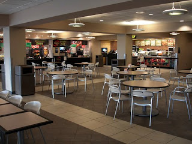

+++
title = 'Love at Work'
date = 2010-01-30T22:11:52-05:00
draft = false
+++

I hated to work on Saturday evenings. Especially since all my roommates would be enjoying in Kilroy's Sports Bar, while I would be cleaning up trash, or serving burritos. That Saturday, I was put up at the Italian food joint, and it was particularly busy. I had never seen so much crowd before, and it was tiring. The only solace was that Hafize was working in a place right opposite to mine.

I first met her when we both were put up in the same place for the shift, the Deli. Being the evening shift, not many people wanted sandwiches, so it was relatively free. I managed to strike a conversation with her, introducing myself, and that I am from India. She introduced herself and said she was from Turkey. Boy, was she pretty! She was the most beautiful girl I had seen in years. I got lost in her eyes for sometime, before I managed to get back to the real world again.

The word 'India' worked wonders, as she started raving about how great and beautiful India is, and how handsome Indian guys are. Then we started talking about the university, our respective courses, how she finds speaking in English very difficult, and so on. She seemed to know most other people working in the food court. As one of the guys, Dan passed by, he commented.

"Hey, nice boo@#" he said to her. I couldn't hear properly what he meant to say, as I shook my head in disbelief.
"Thank you." she replied with a big smile on her face.

I was thinking, what the hell is wrong with this girl. Then I realized she was wearing quite a nice pair of boots. I literally banged my head against the wall. Time seemed to fly as we kept talking. By the time she left I knew it. Yes, I was in love.

Sadly, after that one time, I couldn't meet her much. Even if we did, we didn't have time to say anything more than a 'Hi. How are you?'. Even on that day, there was no way I could talk with her, but I had all the time in the world to look at her. Ah those pretty eyes. I could swim in them forever.

Soon after that, my shift ended, and so did her's. I met her when we were clocking out.

"So, how was your shift?" I asked her.
"Not bad. How was yours?" she asked me back.
"It was awesome." I said with a smile.
"Any plans tonight?"
"Nope, nothing as of now." I told her honestly.
"Oh. Where do you live, by the way?" she wanted to know.
"Park doral apartments, it is near Best Buy. You know?" I tried to explain to her.
"Ya. Actually that is quite near to my place."
"Oh is it? That is cool." I told her.
"You know what? You can come to my place, and have some food. Then I will drop you in your apartment. What say?

I couldn't believe my ears. Did I hear her correctly, or was I just imagining something?

"Er, you have a car?" I managed to blurt out.
"Of course, stupid. Tell me soon, my husband is waiting outside in his car." she said quite clearly.

There was a huge shattering noise heard somewhere inside the huge hall, and everyone rushed to see if any of the glassware crashed to the floor. Alas, it was the sound of my heart breaking.