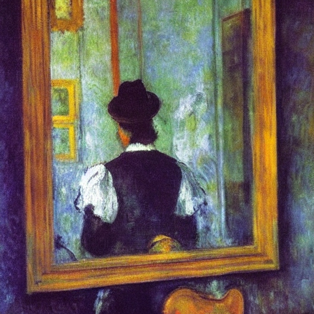

+++
title = 'Stranger in the Mirror'
date = 2008-05-06T02:24:43-05:00
draft = false
+++

It was late in the evening when I entered the crowded street. It was unusually more crowded that day. The more the crowd, the better, I thought to myself. The streets were not only full of people, but also of rotten vegetables and fruits, and other such waste. I negotiated the crowds carefully and after a walk of five minutes, reached the designated place.

It was a tough decision for me, but I had to take revenge. The amount of pain and suffering I had to undergo. The pain of losing my loved ones. It was still fresh in my mind. It was almost forty years back. Still I remembered every single moment. It was as though it happened yesterday. I could never forget it in my life.

Everything was happy in my life. My father had a good job, and I was the only son. The town was a very peaceful one, and my family was one of the most respected ones. All was well, till the then Prime Minister of India, Mrs.Indira Gandhi, declared war on Pakistan in the year 1971. The war ended with the birth of an independent nation, but with the death of my parents.

After the war started, my father decided that we were no longer safe in East Pakistan, and decided to move to India. So, all three of us moved into a refugee camp in a small town in West Bengal close to the border, where thousands of other refugees also stayed. It was a difficult time, since the food was meagre and the sanitary facilities were improper. But still, we managed to survive, and my father was happy that his risky decision had paid off. But he didn't know what was coming.

One day, my mother fell sick. She was running a very high temperature and her face had become pale. So, my father decided to take her to a government hospital nearby and I went along with him. It was a very old and run-down building and the whole place was filled with the stink of urine and excreta. But since there was no other option, my father took her into the out-patient ward, where a middle aged doctor was sitting and chewing pan. My father explained to him what was wrong with my mother. The doctor asked him to wait outside and took her inside an observation room. After sometime, a couple of hefty men came from inside the room and asked us both to accompany them. They told us that my mother had a communicable disease and they were going to check us whether we had it too. They then took us to a room and before we could realize what was happening, tied us both up. We tried as much as we could to free ourselves, but we couldn't.

Then we heard it. My mother shouting and crying for help. My father went mad with anger and tried to bite the rope off. But it was to no avail, and he collapsed on the floor. I tried to wriggle out of the rope, and almost succeeded, but before that, one of the men came and hit me hard on the head, and I fell unconscious. When I finally regained consciousness, I was lying in a heap of garbage, and the body of my father and mother were lying next to me. My mother's clothes were all torn, and my father's throat was cut.

I went to the police station adjacent to the refugee camp, and tried to talk to the inspector, but the only answer I got from him was a slap on my face, and a night in jail. The next day morning, the first thing I did was to go back to the garbage dump and bury the bodies of my parents. It was then I decided that I should somehow within my lifetime, take revenge.

Months passed, and after a lot of struggle, I got a job as a car mechanic in a shop in Calcutta. I worked there for five years, and then got a better job in a automobile factory. It was then, that something good happened in my life after a long time. I fell in love with a girl working as a receptionist in a nearby factory. She reciprocated my feelings, and we got married the next year. Life was smooth and lovely, and she gave birth to a beautiful baby girl. We named her Asha, and she became the love of my life. Though all this was happening, the thought of revenge was still running in the back of my mind.

Finally, one day I got a chance for my revenge. I stumbled upon an old friend from my school days in East Bengal. I learnt from him that he was working for an organization that carried out frequent terrorist attacks in various cities in India, what he termed as 'jihad'. I was immediately interested, and told him I wanted to join the war too. He told me he will contact me later and left.

Days passed, and I didn't hear from him. About three months later, he came to my house. He told me that he had spoken to his leader, and I was free to join the group. He left me with all the details regarding whom to contact and where to assemble for the meetings. I was overjoyed, and at last, had the feeling that I was going to succeed in my revenge after all.

I attended the meetings regularly, and gained the trust of the group. I somehow managed to conceal my activities from my wife, until one day, she found a gun and a lot of grenades inside my suitcase. She got suspicious, and asked me to explain. I told her the truth, and she was shocked. She tried to reason with me that what I was doing was completely wrong. But I didn't listen. The next morning when I woke up, she had vanished from the house with Asha, who was five years old then.

I tried searching for them for a month after that, especially for Asha, but I couldn't find them anywhere in the city. I decided that they must have left the city. I put my heart into training for jihad, to forget the loss of my daughter. Many years went by. I gained ranks, and was ready for any combat. One day, I was called for an urgent meeting in the house of the chief. I went there and learnt that I was to be one of the three chosen ones to carry out one of the most destructive attacks in India. I was delighted, and thanked Allah that my time had finally come.

There was intense planning. Everything had to work precisely on time. The whole mission depended on how quick we acted and we underwent rigorous training. The date, place and time had to be planned so as to cause maximum damage. Everything was taken care of- the weather conditions, the security that would be in place, and the mode of transport. When everything had been decided, we had half a dozen trial runs to make sure that the plan worked out perfectly.

I entered the chat shop in Hyderabad at exactly 7 pm. The shop was full of college students from a nearby engineering college. It seemed like it was somebody's birthday, and all of them were having fun. I got reminded of Asha. She too would have grown to attain the same age. I wondered if her mother had enough money to make her go to college. How would she look like now? I still remembered the unique smile she gave. It was unique because it would look as if she was biting her lip. But she looked beautiful when she smiled. I let my mind wander away when suddenly my cell phone started ringing. I knew who it would be before I even spoke and answered it.

"Everything ok?" the chief asked.
"Everything fine. Will take place in ten minutes exactly." I replied

"Good. Take care."

I put back the phone in my pocket, and went towards an empty corner of the shop. I placed the suitcase in the corner and camouflaged it so much that nobody could tell that there was anything kept there. I then stood near a large mirror hung from a wall. It would take exactly five minutes more. The college students were still there, making a hell of a noise. Four minutes passed. I stood facing the mirror, when suddenly, I noticed a beautiful young girl among the crowd. She was sitting along with a couple of more girls and chatting happily. She looked oddly familiar, something about her face. The girls were all laughing, but she didn't smile at all, but just kept biting her lips. It was then I realized what she was doing. She was smiling, and she was Asha. I rushed towards her, but it was difficult to move because of the crowd. I checked my watch, exactly thirty seconds left. I somehow wished the bomb wouldn't work. I pushed the crowd, and finally managed to reach her, and grabbed her hand. She was startled, and tried to pull away from me. But I had a firm grip on her, and tried to take her out of the shop. Suddenly, a blast ripped through the shop, and a huge ball of fire engulfed the whole place. We both fell down, but I never let go of her hand. By the time I closed my eyes never to open again, hers had already closed.