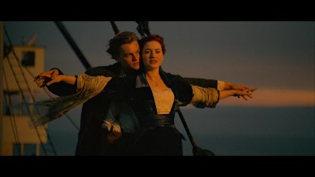

+++
title = "Summer of '98"
date = 2015-09-30T22:14:48-05:00
draft = false
+++

The giant clock in the living room read 4.55 pm as Shenaz Treasuryvala chose yet another ridiculous-looking letter from out of her pile. Ten year old Nitin closed his eyes. He couldn't take the suspense. He knew that everyone else in the room was tense too. He could hear his eldest cousin sitting next to him silently uttering a prayer to the Almighty under her breath. *Please be the Titanic song. Please be the Titanic song.*

Growing up in a middle class Brahmin family in Chennai in the 90's had its fair share of ups and downs. One of the 'downs' was that education took the front seat and anything else didn't matter. Scoring a double century in the district level cricket tournament and helping your team win didn't warrant a praise unless you got a perfect score in the Mathematics exam the next week. Nitin's household didn't have cable television. Watching TV meant watching one of the three channels Doordarshan broadcast free-to-air. Except during summer vacations.

After a mini-mutiny by the four children of the house during the previous summer, it was decided by the elders of the house that Nitin and his three cousin sisters could watch cable television for the duration of the holidays. The subscription would start the last day of classes for the academic year, and would promptly be canceled the day before the first day of classes for the next year. Nitin felt like it was Christmas in May. He could watch Dexter's Lab and Tom and Jerry every day all summer! Of course, there was an occasional squabble with his sisters on what they wanted to watch. But if there was one program that they wanted to watch unanimously, it was *MTV's Most Wanted.*

Every single day of the summer, when the clock struck 4, Nitin and his sisters would gather around the TV to watch Shenaz read letters designed and written by her avid fans from around the country sending in requests to play their favorite songs. Every day, Shenaz would pick her favorite half-a-dozen letters from among the thousands of letters in her pile, and would play the song those fans had requested. The more artistic and grand the letter was, the more it had a chance of getting picked.

1998 was the year of the Titanic. It wouldn't be an exaggeration to say that more people in the world knew who Leonardo di Caprio and Kate Winslet were than who the President of the United States was. The movie earned billions of dollars worldwide, and people of all age groups lined up to watch the movie in theatres. Also very popular was the movie's soundtrack, especially the song *My Heart Will Go On* by Céline Dion. The song topped all possible charts, and 90's kids all around the globe spent multiple hours listening to the song on their Walkmans. Unfortunately for Nitin and his sisters, they couldn't quite convince their parents to let them buy the cassette. So they came up with a plan. They would record it using their tape recorder when the song is played on TV.

It wasn't an outrageous plan. The TV sat right above where the tape recorder was, and they had enough pocket money to purchase a blank cassette. Since it was by far the most popular song of the year, you couldn't watch Channel V or MTV without listening to it twice every day. It was played at least once every other day on Most Wanted. But fate had other plans for Nitin. As luck would have it, every time the song played on TV during the summer holidays, something or the other would prevent them from recording it. Once, Nitin forgot to put the blank cassette in before hitting record. Another time, the power went out just as the song was about to be played. Unexpected guests, cable TV blackouts, quarrels within the family, summer vacation trips, weddings, and cricket matches happened. They could never get the song on tape.

Soon, it was the last day of summer vacations. This was it. If they couldn't get Céline Dion to sing on TV that day, they could never get her on tape after that. The next summer would be too late, as the song's popularity would wane and be taken off air. The four children were camped in front of the TV with the tape recorder ready. But they had had no luck all day. It was almost as if the universe was conspiring against them. At 5 pm, the cable guy would arrive to cancel the subscription. And that would be the end of their *Titanic* song dreams.

The kids in the living room held their collective breath as Shenaz opened the final letter of the day and read its contents.

*"...and I love your show so much! I think you are the prettiest girl on TV! This is the first letter I have written for any TV show! So if you could please play me the song 'My Heart Will Go On' by..."*

The next couple of seconds were filled with overlapping screams and shrieks of excitement. Nitin almost tripped on his own feet as he jumped up with joy. This time, he was sure they would get the song on tape. He remembered to hit the record button on the tape recorder. You could hear a pin drop as the song started playing on TV. He had already triple-checked that the cassette inside the recorder was blank and ready to go. When the song ended, everyone huddled around to verify if the song had been recorded correctly. As the cable guy turned up on time to disconnect the line, the sweet voice of Céline Dion echoed throughout the room. Now they will have the song on tape for eternity! They could listen to it as many times as they wanted. And whenever they wanted. That was the moment they had been waiting for. It was the happiest night of the summer for Nitin, as he drifted off to sleep listening to it on his Walkman.

-----------------------------------------------------------------------------------------------

Nitin stumbled into his apartment after a long Monday at work. He gulped down the burrito he had bought for dinner on the way back, and went straight to bed. He did his nightly routine of opening Spotify on his phone and plugging in his earphones to listen to some tunes before retiring for the night. As usual, he opened the *Discover Weekly* playlist, and hit *Shuffle Play*. On came a song that he hadn't listened to in a long time, and as sleep engulfed him, a hint of a smile appeared on his face as he remembered the moment many summers ago.