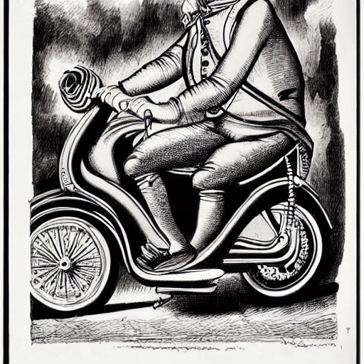

+++
title = 'Super Moped'
date = 2008-05-18T09:28:50-05:00
draft = false
+++

We reached the usual place where we regularly had lemon juice at around eight o clock. It was another hard day at the tuition center. There was a surprise test in chemistry, and we couldn't answer even one question. As usual, we ordered each of us a lemon juice and were seriously thinking about what we were going to do in the Board exams, even if they were half as tough.

Sam had brought along his new bike. And me, being the most knowledgeable guy in motorbikes among the four, he wanted me to test ride it to check how smooth the engine was. I myself had a two-wheeler though the others would rather call it by a derogatory name, 'moped'. It was a decent bike, gave a good mileage even when I was handling it rather roughly. But still, they wouldn't listen, and the name stuck with my poor bike.

We started, and i drove Sam's bike with him sitting in the pillion. I usually never gave my bike to anyone, because none of them except me even had a learner's license, but that day, without realizing it, I gave the keys to Sid, and Krishna was to ride pillion with him. I took off, with the 15 bhp engine powering my pick up, and I was in Krishna's place by 2 minutes. The bike was great, and I just loved the feel of it. I told Sam what i felt, and he beamed with pride. We went on chatting about the bike, when we realized that Sid and Krish hadn't turned up.

We rushed back to the juice shop and searched for them along the road, but they were nowhere to be seen. We came back to Krish's place and just parked the bike outside when his mother called us from inside the house. We rushed inside, and she told us that Krish and Sid had had an accident and they were admitted to a nearby hospital. We took the bike and raced to the hospital, and entered into the OP ward.
Krish was standing next to a doctor, who was attending to Sid. Krish seemed to be fine, but Sid was the one who bore the brunt. His hands were full of broken glass pieces and he was writhing in pain. I called Krish aside and asked him to explain what happened.

"I don't know how it happened da. But we were going at sixty, and suddenly there was an auto taking a U-turn right in the middle of the road. Sid panicked, and forgot to apply the brakes!! He dashed against the auto, and I fell sideways on the road. Sid fell in the front due to the jerk, and hit against the windscreen of the auto. That's why his arm is full of glass pieces and they are mostly going to do an operation to remove them."

"Okay. Where's the bike now??" I asked him.

"Come with me. I will take you to the accident spot. The auto driver has got hold of your bike and is not letting us take it."

We walked to the place, and indeed the auto driver was sitting on the bike. The first thing I searched for was to see whether there was any damage to the bike. I couldn't notice any. Then I saw the auto, and knew instantly why the man was not giving us the bike.

The auto looked as if it had been hit by a lorry. The windshield was completely smashed. The headlight was twisted , and the front of the auto had caved in. I couldn't help but smile to myself. Sam was amazed. He couldn't believe that an auto could be damaged so much by a moped. Even I couldn't believe it. And the incredible part was that my bike had not even suffered the slightest damage. From then on, no one teased my bike as moped, but it came to be known as the "Super Moped"!!!