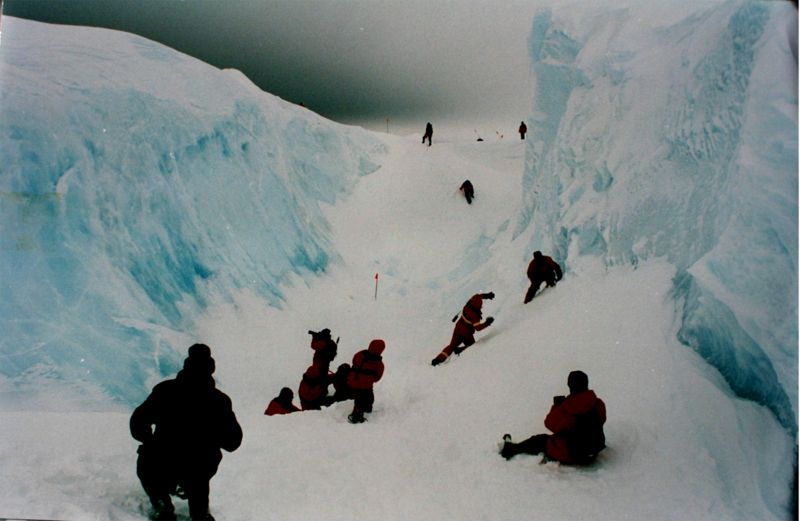

+++
title = 'The Expedition'
date = 2008-05-20T07:07:42-05:00
draft = false
+++

It was our fifth day aboard USS Kentucky. The dipping temperature told us that we weren't too far from our destination. It wasn't exactly a smooth voyage. We had encountered a horrible storm near French Polynesia, and another in the middle of the South Pacific Ocean. It was noon, but the climate was so cold that we had to wear layers of warm clothing.

It all started two weeks back. NASA scientists were trying to map the glaciers of the south pole when they stumbled upon something big. Their satellite, "Terra", captured live images of the largest ice-shelf of the Antarctic, the Ross ice shelf, which signaled a potential catastrophe. It triggered of a series of urgent high level meetings, and within the next week, the US President signed an order authorizing an expedition to proceed to the South pole to witness the cause of damage. Being one of the top geologists in the US Government, I was to be in a group of twenty people from all across the globe, who were chosen to be a part of the expedition.

The press were kept away from this of course. If it had leaked to the press, it would have fueled widespread protests against the US Government since it was the largest contributor of green house gases and especially because it refused to sign the Kyoto protocol. Everything was planned secretly, and all the scientists chosen from different countries- Dr.Donghai from China, Dr.Rutendo from South Africa, Dr.Holturen from Brazil, Dr.Sukumar from India, Dr.Davies from Australia, Dr.Taro from Japan, Dr.Conaire from the UK, Dr.Landon and myself from the USA, all of them were pro-US. Apart from the nine scientists, the other eleven consisted of the ship's crew.

Two hours later, we saw the first mass of ice. It was floating in the middle of the ocean, and was enormous, about twice the size of the ship. Then we realized it wasn't the only one. As we passed the first one, we could see only glaciers as far as our eyes could reach, with the ocean water just filling in the gaps between them. It was now that absolute care was required to navigate through the glaciers without being hit by any of them. Even though we were equipped with the world's most advanced navigation system, it was still scary as we passed each ice berg at close range.

It was almost six o clock in the evening when the captain of the ship announced that the ship would go no further. Indeed it was a sight to behold. We were surrounded by ice on three sides. The only possible transport after this would be to use a motor boat. We decided that it was too late to venture out into the sea at that time, and postponed it to next morning, though we were all very anxious about what we were going to witness the next morning.

It was unbearably cold when we got into the motor boat early next morning. We took enough supplies for it to last a minimum of three days, though we wouldn't be spending more than fifteen hours outside. We also took with each of us a SatFone. The boat navigated the ice with ease and we progressed very quickly. About an hour later, we saw it. The Ross ice shelf. And it was full of penguin carcasses.

We anchored the boat near to the shore and got out on to solid ice. The whole place was like a mass graveyard and thousands of penguins lay dead, as far as our eyes could reach. It was a pitiful sight. The biologists among us, Dr.Davies and Dr.Sukumar, started to analyze one of the dead penguins. We wondered what could be the reason. Surely it couldn't be due to rise in temperatures because penguins are known to live in much warmer climates.

The remaining seven of us decided to venture out a little further. We trod past the dead penguins towards what was known as the Barrier. It was the highest point on the ice shelf, and it rose to around 500 feet towards the sky. All around it were layers of some thin and some thick ice. We decided to look beneath the cliff for any clues that explained the death of all the penguins. As far as we could see, there weren't any. So we decided to move further,

It was Taro who noticed it. A particular area covered by thin ice was vibrating continuously. We went closer to see what was happening. On closer inspection, we found that there were gas bubbles circulating in the water under the layer of ice. I took out my pocket gas analyzer and inserted it into the water through the ice. I let the gas to come into contact with the sensor and tried to tilt it into position slightly. Big mistake.

Before we could know what was happening, the ice cracked and the the gas escaped out with an explosion. I tried to rushed back, but the whole area of thin ice started to disintegrate and before I could move, my lungs were full of the gas. I could no longer stand still, and fell down on top of the ice. Before I lost my consciousness, I saw the others lying unconscious on top of one another.

It seemed like eternity before I finally regained consciousness. I was lying down inside the medical center in the ship. As soon as I opened my eyes, Sukumar rushed towards me.

"How are you now?" he asked.
"Quite okay I think." I answered weakly.
"We have found the reason for the death of the penguins. And that is exactly the same reason why all seven of you fell unconscious. Carbon monoxide."
"Carbon monoxide? But how come under the ice? And that too the cause of death of so many penguins?" I was astonished.
"Yes. I will tell you how we found out. We analyzed the lungs of the dead penguins, and it was full of carbon dioxide. Carbon monoxide entered their lungs, and by oxidation, got converted to carbon dioxide. How it came to be deposited under the ice? By oxidation of methane gas. There were huge deposits of methane gas under the ice, and due to global warming, the thick sheets of ice got melted and formed thin sheets instead. Due to action of UV radiation on methane, it got oxidized into carbon monoxide, and not carbon dioxide, because of the low concentration of oxygen under the ice. These deposits are all over the place, and you just blew one up yesterday."

I closed my eyes. I could still not forget the sight of all the dead penguins. All due to man's stupidity and selfishness. I wished that all the people in the world could know what was going on, but I knew it was close to impossible. This news would never reach the media. It would all be covered up. No one cared if penguins lived or not. For the first time in my life, I was ashamed of being born as a human.