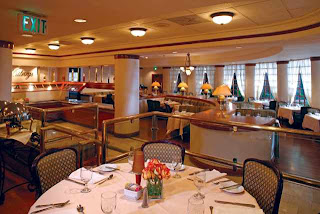

+++
title = 'The Last Wednesday'
date = 2008-12-24T21:29:18-05:00
draft = false
+++

The last rays of the winter sun fell on the window beside me when my cell phone started ringing. It was Akhilesh.

"Hello papa? When are you coming home? It is almost six o clock!!!" He was almost screaming into the phone.
"Just leaving office, beta." I replied. I had forgotten that it was the last Wednesday of the month. "Sorry beta had some important work. Will be there in twenty minutes."

Akhilesh was born on September 30, 1998, which was the last Wednesday of the month. Before he was born, Sarita had a miscarriage. The baby girl was still-born. The miscarriage deeply affected both of us, and we made sure Akhilesh had everything he wished even before he could ask, right from the moment he was born. And we went out for dinner the last Wednesday of each month, to a restaurant of his choice.

I went outside and started my car. By the time I reached my home, Akhilesh was waiting at the door along with Sarita, all ready to go.

"Which restaurant this time dear?" Sarita asked him.
"Masala Craft!!" he replied with enthusiasm.

Masala Craft was his favourite restaurant. Though the prices were on the higher side, the delicacies on offer were the best. It was also my favourite restaurant, as the waiters there were always friendly, and ready to help. The traffic was thankfully low, so we reached there in thirty minutes, which normally would have taken more than forty five minutes.

Leaving the car to the valet, we entered the restaurant. The smell of hot chicken curry filled the room, and made my mouth water. We sat in our usual place, the table next to the grand french window, which afforded us an exquisite view of the city's skyline. Suraj, my favourite waiter, greeted us with his charming smile. Akhilesh started jumping as soon as he saw him.

"Suraj bhaiya!! Where is my chocolate??"
"Yes dear, here it is." Suraj took a huge bar of chocolate from his pocket and gave it to him. It had the hotel's name embossed on the wrapper. He always had a bar of chocolate ready for Akhilesh. Suraj took our orders and left.

I liked Masala Craft for another special reason. It was here that I first dated Sarita, though it couldn't be classified as a date as such. It was twelve years back. I was working as a marketing executive in a top finance company, while she was an MBA student. Our company had organized a training program for MBA students of all the top management institutions in the city in that particular hotel. Being one of the trainers in the event, I noticed that she was the prettiest girl among the lot. And the brainiest too. She asked me a lot of questions after a rather long talk that I gave, and deliberately, I told her that I would clear all her doubts over a cup of coffee in the restautant. And there it all began. We eventually got married three months later.

A sudden sound of gunshots dislodged me from my thoughts. It sounded from a place very near to where we were, and no one in the restaurant knew what to do. As silence filled the air for a couple of moments, I started doubting whether they were gunshots at all. But suddenly, one of the waiters rushed from inside the kitchen, blood in his hands and shirt, and signalled us to leave quietly. Some of the people started running towards the exit, while some really confused people chose to hide under their tables. I took Akhilesh in my arms, and grabbed Sarita's hand, and started rushing towards the exit. There was chaos all over the place. No one knew what was happening.

We heard more gunshots, and this time, it was right behind us. Someone at the back of me got hit by the bullets, and he fell down clutching his abdomen. I turned back, and saw two men, dressed in t-shirts and cargos, both of them were holding machine guns. I saw that Suraj was standing on the other side of the exit door, helping people out of the restaurant. I rushed as fast as possible to the exit when the men started shooting again. Akhilesh had almost fainted with fear.

I managed to get all of us out of the restaurant, with the help of Suraj. But the situation in the floors outside the restaurant was even worse. People were running helter-skelter and there was confusion and fear everywhere. I heard a blast some floors above, and there was a sound of glass shattering. I decided that it was best to get out of the hotel, since I feared that there were more than two gunmen inside it. I asked Suraj to come with me, but he refused to come, saying there were more people trapped inside, who had to be saved.

I thought it was safer to use the stairs than the lift, especially since there was fire in the higher floors. As soon as we reached the hotel entrance, I searched for my keys among the many keys that were kept near the valet. It wasn't an easy task because there were ten other people searching for their keys. I finally found my key, and ran to the parking area, asking Sarita and Akhilesh to stay back. Luckily I found my car parked in front. I drove the car near the exit and ran back to bring Akhilesh and Sarita.

But just as I was starting to move away from the hotel, I saw an elderly man writhing in pain near the lift. It seemed that he had broke his leg trying to run, and the place where he was lying was very close to the gunmen. I realised how selfish I had been, and asked Sarita to drive Akhilesh to the nearest hospital. She flatly refused to leave me behind and go, but I told her that I had decided to stay back and help the wounded. I assured her that I would be safe, but it failed to convince her.

I finally decided to atleast help the old man, and come back. She was reluctant, but before she could say anything, I rushed to the man, carried him over my shoulders, and ran back to the exit. I then signaled Sarita to carry Akhilesh and follow me to the car. There were more blasts and gunshots from inside the hotel. I started the car, and sped out of the hotel. At last, we were safe, or that was what I thought.

I saw two men running on the road towards the car. I tried to swerve out of the way, but it was then I saw that they too were having guns. And they shot right at the car. I felt a couple of bullets pierce into my chest. Sarita saw it, and screamed. I accelerated the car more, and sped out of the place. When I decided that it was safe enough to stop the car, I stepped on the brakes. I was dying, I knew it. Sarita helped me out of the car, and shouted for help. But there was no one to listen to her cries, as they were themselves in need for help. I kissed Sarita and Akhilesh on their foreheads, held their hands, and went off to a distant place.

*Note: This story is not a true one. It is purely a work of fiction. But Masala Craft is in fact, a restaurant in the Taj Mahal hotel, Mumbai. I dedicate this story to all those innocent common people who lost their lives in the tragedy, and the hotel staff who saved many lives.*