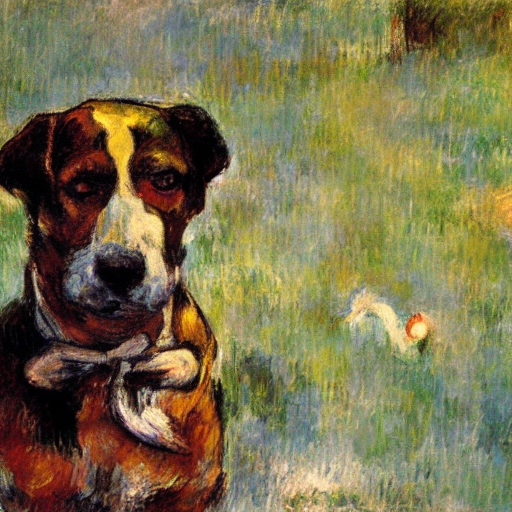

+++
title = 'The Museum Mystery (Part 3)'
date = 2008-05-25T21:07:18-05:00
draft = false
+++

*If you missed out on [Part 1](the-museum-mystery-part-1.md) and [Part 2](the-museum-mystery-part-2.md), please click on the respective links to read it.*

The alarm woke me up at exactly 4 in the morning. It was still dark and cold, but there was work to do. I had already decided what to do that day. After a shower and a quick breakfast of roast bread, I was on my way to my office. I called up Harvey on the way.

"Good morning Harvey. Be in my office in ten minutes."I told him.
"Sure, sir." he replied obediently.
"Good." I said and ended the call.

I was there in my office by five o clock, and Harvey was waiting outside the door. No one had the keys to my office other than me. I opened the door and asked him to come in.

"Do you have the videos taken by the CCTV camera in the museum?" I asked him as soon as he entered.
"Yes sir, just give me a minute. Will bring them to your desk."
"Ok, be quick."

I switched on my computer and let it boot. Harvey was gone for a couple of minutes, and came back with the DVD of the videos. As soon as he gave them to me, I inserted the disk and watched it play.

"How long does it run?" I asked Harvey.
"About one hour, sir. The power cut happens about twenty minutes into the video."
"Ok, but I want to watch it from the beginning."

The museum had six cameras, and the feed from each one of them was displayed in one part of the screen, so that I could see the feed from all six simultaneously. I watched every movement closely, taking care not to miss any detail. Nothing notable happened for about fifteen minutes. Then I saw it.

It was no more than a blur on the screen and passed through the side entrance right at the moment when the security had turned back to attend to a phone call. I paused the video and made it rewind slowly. Still it wasn't clear who passed by. I decreased the speed again to the minimum and watched closely. It was then I found who it was. I remembered what had happened the previous day. Yes, it was the only possibility.

I watched as he moved from one part of the museum to another, along with the crowd so that he couldn't be seen in the camera prominently. Surprisingly, nobody took notice of him, and he moved with freedom, close to the ruby. Then, the power cut happened, and the camera got switched off. When the power came back again, there were scenes of tension when it was discovered that the ruby had been stolen, and all the people were being sent into the curator's room. I felt I had seen enough to determine the culprit, and turned off my system.

"Come with me, Harvey. I think I have found the culprit."

I started my car as soon as Harvey entered it, and I zoomed to the museum. It was still closed for the public, and I parked the car in the parking area. Now was the tricky part. I called up a couple of security men, provided them with the details of the appearance of the culprit, and asked them to search for him. They looked at me with bewilderment, but started the search. I felt that if I was lucky, he would still be in the same area.

I decided to search for him in the area close to the museum. I went around the place a couple of times, and went on to search the whole neighourhood. I searched everywhere, but there was no trace of him. One hour into the search, and I had almost given up on him, when I saw him. He was sleeping peacefully under a tree. I, at once called up all the security people and asked them to round him up. Hearing the noise, he tried to run off, but he couldn't. Frustrated, he tried to attack one of the men, but he was then shot, and went down.

The operation was a success, and the ruby was safely removed from the dog's stomach. It was then nursed back to health, and released back into a place far away from the museum.