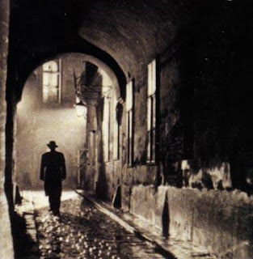

+++
title = 'The Rainbow'
date = 2008-12-27T21:32:15-05:00
draft = false
+++

The air inside the room carried the odour of a dead rat. Not that it mattered much. That was all he could afford. His troupe had been in dire straits for the past ten years. But he was forever an optimist. He always told them that there would be a miracle. And there would be money. Though it all sounded encouraging then, now it seemed a lot hollow. But he still had hope, and he still hoped for that miracle to occur. May be not today, but tomorrow perhaps.

He locked his one room apartment and started walking. It was a very cold December evening, and he had no winter clothing except an old rugged jacket. Though for the first time he wore it, he was numb with cold, he was amazed at how he felt warmer as he got used to it each day. The road was almost empty, and wet. No one wanted to leave the comforts of a warm home to come out in the cold. As he walked, he passed by a huge house, guarded by heavy gates, which seemed almost like a castle. Memories came gushing into his mind, it always did when he passed that way. The house was once his abode.

But that was nine years back, and after that, his dwelling place became smaller and smaller, until his present one, which had only one room. He could hardly pay the rent for this one too, but the house-owner was an old friend of his, who didn't mind letting him stay there free of cost, as its rent was lower than the tip he gave his chaffeur daily in the evening. But as a man who prided his self-esteem more than anything else, he somehow managed to pay his friend the rent on time every month. He always told the others that if given an option between a hundred room bungalow and the one-room apartment, he would always choose the latter as that was all he needed. But no one ever gave him that option, so no one actually got to verify his statement.

As with any living organism, food was his major worry. Last month, he had sold the last piece of gold he had for a handful of dollars, which he sensibly deposited into his bank account. It paid for his bread and butter till the day before, and now again, he was penniless. Not that it was the first time in his life that he was in such a situation. He always believed that somehow, he would one day become as rich as he was once. But how that somehow would happen, was a tough question.

He slowly marched towards his destination. He was briefly distracted by a stray dog that was feeling quite cold, and thought it could share his jacket. But he shooed it away. He had once suffered from cynophobia, but that was quite long back. After all, being thrown to the streets does have its own advantages. It can relieve people of all their phobias, since they would be experiencing exactly what they fear, everyday. He now considered dogs as a mere nuisance, which he could always get rid of. He had better things to do.

The old, run-down building was a sharp contrast to the modern and elegant ones surrounding it. The fading light enhanced its eerie feel. A large, bright hoarding placed right next to the building caught his eye, which proclaimed the release of a latest Hollywood flick that was supposed to hit cinemas soon. Damn Hollywood, he thought to himself, as he entered the building.

The door let out a loud creak as he entered the hall. The four humans and the three cats (which had blissfully made the theater their home, happily chasing away rats) inside the hall stood up. He smiled as he glanced at each of the four men, who had dedicated their lives to The Rainbow. The men looked at him with anticipation. He had promised them that he would reveal his decision that evening.

"My dear fellows!" he spoke loud and clear. "As I had promised to you, I will now reveal my decision about the future of The Rainbow, for which we had worked day and night for so many years."

The air thickened with more anticipation as he continued speaking. "We have been together as a family for more than ten years. We have shared our joys and sorrows, and we have passed by the highs and lows together. It is an open secret that we are now in deep debt, and however optimistic I was about the improvement in situation, I have now been hit hard by reality. Frankly, I don't see the situation improving. I admit that we have no option, but to abandon all our hopes."

He had tears in his eyes. He was sure that the other men were sobbing silently too. The Rainbow was like their baby. They had nourished it when they were young, watched it grow, and sadly, also saw that it was now dying. Its lifetime was over.

He couldn't help going back in time, when The Rainbow was flourishing. Though, in the beginning, people were skeptical about it. But as word spread about it, the crowd started coming in. People came in from other cities to witness it. Money started pouring in, and all the five were rich, happy and famous. They built huge houses, bought the latest cars, and enjoyed like there was no tomorrow. Amidst all their happiness, they didn't realize that nothing lasted forever.

If he was the head of The Rainbow, Stephen was its face. He was, by far, the most popular among the six. He was the best among them, and crowds thronged just to watch him. Most of the money therefore was collected due to Stephen's charisma. But the celebrity status slowly and steadily got to his head. And therefore one day he announced to his friends.

"I am moving to Hollywood. One of my friends is a director there, and he said I had great potential to be one of the best actors in the country. I'm leaving The Rainbow for good. I hardly get any recognition here."

So that was it. Even after much persuasion by the others, he refused to change his decision. He left, and since there was no more Stephen, there were no more crowds. However innovative they made the script, there were hardly any people to watch it. They even tried a couple of new actors in his place, but none worked. And there, the end started. The people moved on to better things, and quickly forgot The Rainbow.

As for Stephen, he got to act in a couple of scenes in a B-grade movie, and that was it. There was no news of him for a long time. They later learnt that he was found dead in one of the streets, and he had died of starvation. They shed tears for their dear friend, and a very good stage performer.

He forced his mind to come back to the present. He continued speaking to his friends.

"I have decided that we will have one last show. That will be tomorrow evening. It will be the end of The Rainbow. We divide whatever we get tomorrow among us equally, and part forever, my friends. Is this fine with all of you?"

No one spoke a word. The talk ended there, and the rehearsals for the last play began. The play was aptly titled 'Rainbow's Ending', written by Noel Greig. The rehearsals continued till late at night, and then they all dispersed to their respective abodes.

The day quickly passed, and the time to start the play arrived. They hoped that at least one spectator to turn up, but there were none. They waited for audience, but for half an hour, there was none. He decided that they would start the play, with an audience or without. Just as they were about to begin the play, a man entered the old hall. He wore dirty clothes, and had himself covered with a tattered rug. They couldn't see his face, since it was dark.

"I am a beggar. I have no money," he spoke in a coarse voice, "but I thought I can watch the play."

They didn't object, and were actually happy that there was at least one person who was going to witness their last play. They started the performance.

It was an astounding performance. The play was a very emotional one and it was portrayed well by all the five men. If only there were people in the audience, they would have all been in tears. The lone man clapped at the end of it all. The lights were turned on at the end of the play. They then saw his face.

"It was really an excellent performance, my brothers!" Stephen spoke. "It reminded me of our old times, when I was alive and was one among you. I tell you, there was not one day after I left The Rainbow, that I didn't regret my decision. But I couldn't just come back and join again. I thought you wouldn't accept me again. How wrong I had been!!"

The others couldn't believe what they saw and heard. They stood dumbstruck to talk anything. But Stephen wasn't waiting for a reply. He continued.

"I was up there, listening to all of you speaking about today being the last play. I couldn't afford to miss that, can I? I have already missed you people more than anything else. So, I decided to witness it. Now as I have seen it, I am at peace. I ask for your forgiveness, my dear brothers, but I have been the result of your downfall. Please forgive me. Lord be with you."

Before any of the five could react, Stephen disappeared into thin air, right in front of their eyes. And there was darkness again.