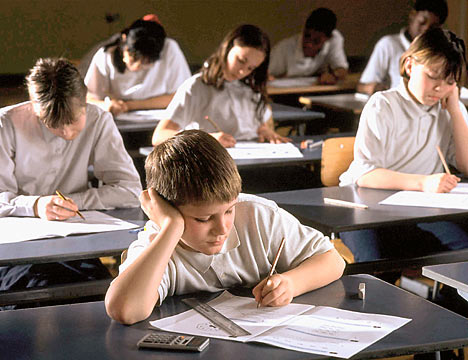

+++
title = 'The Unforgettable Exam'
date = 2008-05-29T21:13:20-05:00
draft = false
+++

It was the day of my last exam after which the summer holidays were about to begin. My parents had already planned a trip to Ooty during the holidays, and I was too preoccupied with it, that I hardly prepared for the exam. Not that the exam needed preparation. The subject was General Knowledge, in which I was the topper, every time. I was also good in quizzing, and my general knowledge was much higher than that of an average seventh class student.

I parked my bicycle in the parking area, and proceeded into the exam hall. Though all other exams had a definite seating arrangement, in this exam, we were free to sit in any order we wanted. I managed to get a seat near a window, and was hoping that any of my friends would come and sit next to me. But unfortunately, I didn't notice until it was too late that the seat next to me was damaged, and no one wanted to sit on it. And all the other seats were occupied already. But one student was yet to come, because the all the seats were meant to be occupied, and the seat next to me was empty.

It was almost time for the exam to start, and I was wondering who this guy or girl was going to be, when Amritha entered the classroom. She was the most studious girl in my class, and was the most good-looking too. I thanked my lucky stars that I chose that place, as she had no other place to sit, except the seat next to mine, where she eventually sat. I was blushing profusely when the exam started, and I spent half my time looking at her than at the exam paper. I finally decided to concentrate on finishing the exam first, and focused fully on the question paper.

Most of the questions were easy, and I managed to answer almost all of them. When I finally managed to finish the paper, twenty minutes were still left for the exam to get over. So, I was sitting idly staring at the paper and trying hard not to stare at Amritha. Suddenly, I heard a faint voice calling my name. I turned to see who it was. It was her!!

"Hey, do you know the answer of the seventh question?" she whispered to me.

I checked what the seventh question was. Mention the name of the current Finance Minister of India. What a pity! She didn't know the answer for this!!

I whispered back the answer.
"Huh?" she couldn't hear me.
I increased my volume a little.
"Got it. Thanks da!" she replied gratefully.

What happened next was unbelievable. A girl sitting behind me overheard the answer, and wrote it down. The guy sitting next to her copied it from her and passed the answer to his friend sitting in the next row. This way, the whole class had wrote the same answer, though I came to know of this much later.

The exam got over and I cycled home quickly to pack my things for the holiday trip. I was still packing when my dad came home from office and switched on the TV, just in time for the 7 o clock news. I sat next to dad and watched as the news reporter read out the headlines. Finance Minister Mr.P.Chidambaram has announced full waiver of farmer loans in his budget. What?? How??

REWIND....

"Hey, do you know the answer of the seventh question?" she whispered to me.

I checked what the seventh question was. Mention the name of the current Finance Minister of India. What a pity! She didn't know the answer for this!!

"Lalu Prasad." I whispered back the answer.
"Huh?" she couldn't hear me.
"Lalu Prasad!" I increased my volume a liitle.
"Got it. Thanks da!" she replied gratefully.

I cursed myself for having been such a fool. How will I go and talk to her again? And the whole class had written the same wrong answer. I suddenly had a vision, as if all the students in my class had surrounded me and were looking at me menacingly. I wished that Amritha hadn't noticed my mistake at all.

It was time for the new academic year to begin. I parked my cycle as usual, and was climbing the stairs, when I saw Amritha going in front of me. I decided to tell her a sorry, and so went up to her.

"Hi." I told her.
"Hi Karthik. What's up?" she replied.
"Uh..during the GK exam...I guess you would have realized by now....er..I'm sorry..." I stammered.
"What? I don't get you. I should thank you, in fact. Why sorry?"

Just at that moment, the bell rang and she ran inside the class. Poor girl. May be she didn't realize that I gave her the wrong answer. The day got over soon, and I pedaled back home as usual. When I entered my room, I realized that Mom was cleaning up my room. I decided to help her. My table was filled with papers, and I was arranging them neatly, when I stumbled upon my GK paper. I was still deciding whether to keep it or throw it off, when I read the seventh question again. Impossible.

Mention the name of the current Railway Minister of India.