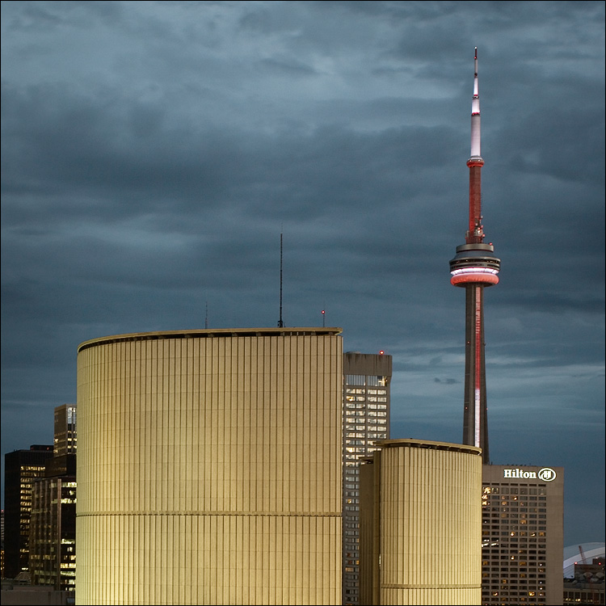

+++
title = 'Turbulences'
date = 2008-05-27T21:11:12-05:00
draft = false
+++

The sky grew darker as I stepped out from the elevator on to the terrace. A strong wind was blowing across my face and dark clouds were gathering everywhere. I felt as if the sky reflected the situation inside my mind. Life was so perfect, some years back. The company was doing good and his family life was so happy. Everything was moving as if nothing could go wrong. Then, everything went wrong.

I started work on my dream company as soon as I finished my Masters degree in Automobile Technology. The idea of becoming an entrepreneur blossomed into reality, as I put my thoughts into actions. The money came from various banks, the technology was imported from Germany, and a large factory was in a small town with ample natural resources. I took care of even the minutest details so that there was no mistake anywhere. Close to thousand skilled workers were employed from various places, and I personally interviewed every one of them. After six months of sleepless nights, "Delta Motors" became a reality.

I started off by manufacturing tractors, as I felt that there was enormous potential in the market. Delta tractors were marketed in every village of the country, thanks to the best marketing and distribution team in the whole of the country. The tractors became a phenomenal success, and Delta motors became a mark of quality and dependence. It was then, that I decided to start the next step.

I introduced the next category in the product portfolio- small cars. The "Kat" was introduced into the market at a lower price than all other cars in the class, and featuring the best technology in the country. The car gave an exceptional mileage, and featured top class technology, thanks to the company's R & D department. Another success story was thus scripted.

The company grew, and so did the portfolio. The next car was a sedan, the "Elegante", and then came two more small cars, the "Dude" and the "Spider". Though the Spider was expected to sell more, the other cars became bestsellers. The company got listed, and the shares sold like hot-cakes. Delta Motors exported their first car to the USA, five years after its inception, to compete with the likes of Ford Motors, General Motors and Honda. The "Elegante" was renamed as "Crystal" to suit the American market, and the initial response was excellent, with sales of more than five hundred cars in the first month alone. After about eight months in the American market, an USA-specific model, the SUV "Ranger" was introduced. It was an enormous success, and three months after the introduction, the Ranger became the market leader in its segment.

I first saw her when I was interviewing people for the marketing wing of Delta Motors, when she had come to apply for the job. She had this heavenly glow surrounding her, and something about her attracted me towards her like a magnet towards iron. At 31, I myself was a handsome, and charming young man, and I summoned all my charms when I asked her out for the first time. We clicked instantly, and six months later, we got married. It was the happiest moment of my life. It was after she came into my life, that every step I took was a success.

I became a father one year later, when she delivered a beautiful baby boy. He was the source of all our happiness, and as years passed, he became a smart young boy, ready to attend school. He was sent to Cognizance Public School, the best school in the country. He always got the best clothes, best food, best stationery, and all the latest games. I made sure he always got what he wanted. I was too happy, and may be should have realized it then that turbulences were soon to follow.

That morning, a scandal was discovered in the stock market, Numerous number of stock brokers were found to be frauds, and the stock market crashed. The stocks of Delta Motors were the worst hit, since a large number of the fraudulent brokers were found to deal with Delta's stocks. Many other companies were badly hit too, and a couple of banks became bankrupt. The price of Delta's stocks became cheaper than the money spent on printing it. It was the worst day of my life, but more was to follow.

I came home dejected, and found that the door was open. I searched the whole house, but both my wife and my son were missing. When I was searching the bedroom, I found a letter written by her saying that she had eloped with her long time secret lover along with my son, and they were going to marry that day. I was devastated that she had chosen to leave me when I needed her the most. I didn't want to live anymore.

The wind was gaining more strength, and once I almost lost my balance. I walked cautiously towards a corner of the terrace and looked down. The building was fifty floors high, and there was no chance that anyone would survive the fall, The dark clouds were gathering above my head, and there were streaks of lightning all over the sky. I paused for a moment as there were sudden claps of thunder, as if they were waiting for this to happen for a long time. I closed my eyes, and prayed for my wife and my boy. Then as I stepped over the wall, the sky became silent, and the clouds started to cry.