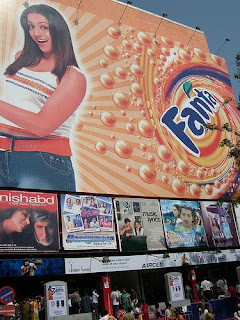

+++
title = 'When Money Flies'
date = 2009-01-07T21:35:53-05:00
draft = false
+++

"So, where shall we go?" my eldest sister, Radhika, asked no one in particular. 

"I suggest we go to the beach. And have nice hot onion bajjis." my younger brother Mukund, a die-hard foodie, replied. 

"Shut up, Mukund." It was Vindhya, my second sister. "Why don't you try thinking about something other than food?" 

"Oh Vindhya, stop teasing him." Radhika managed to prevent yet another fight between the two warring siblings. Being born as one among four children in the house, has its own share of advantages. For one, you can always enjoy watching the fights that always occur among the others. 

Being the third of the four children, I was the most peaceful and silent of the four. Not that I wasn't naughty, but I was smart enough to make sure no one noticed it. The particular discussion going on was to decide where we could all visit for the new year. 

"How about a movie?" I finally decided to open my mouth to speak. 

"Movie? Which one?" Mukund asked. 

"Vaaranam Aayiram. No other movie is worth watching for now." I reasoned. 

"Oh come on! I just saw that last week with my office colleagues!!" 

It was Radhika. I had completely forgotten that she had gone out with her office friends to the same movie the previous week. 

"So what? We haven't seen it yet! So it will be Vaaranam aayiram." Vindhya delivered the judgement. 

But the discussion didn't end there. Radhika was completely opposed to it, and wanted to go Rab Ne Bana Di Jodi instead. But after a lengthy debate, which included a majority vote in which Vaaranam won by 3 votes to 1, she finally conceded. I was chosen to buy the tickets, since every other person had some other work to do, and I was the only one who was jobless. 

"Here, take this five hundred bucks. Buy it and come soon." Radhika handed over to me a crisp new five hundred rupee note. 

I took off in my bike straight to Satyam Cinemas. I hoped there would be no crowd for the tickets, since the movie was quite some days old. I parked my bike and went to the advance ticket booking counter, but to my dismay, the whole place was flooded with people. I couldn't even see if there was any other movie to which tickets were available. I decided that it was no use waiting at the counter, and turned back to the parking area. Just then, I heard a voice. 

"Hey boy, want tickets?" 

I turned to see who it was. It was a middle aged man, around 40 years old, wearing a dull grey shirt and black trousers. 

"No, thank you." I didn't want to encourage black-ticketeers, lest to be caught my police in mufti. 

"I'm not selling tickets in black, my boy. I had bought some tickets for my family for new year day, but we have decided to go somewhere else. That is why I am selling these." 

I didn't know whether to believe him or not. He looked like a pretty decent man, so I decided to try him. 

"Ok, how much?" I asked him. 

"Let us not talk here. It is not safe. We will go outside." he told me, and started walking towards the exit. I followed him. He entered a by-lane adjacent to the cinema hall and finally stopped walking. 

"How much?" I asked again. 

"The actual cost is hundred rupees. I will give it to you for hundred and twenty five. I have four tickets with me." he told me. 

"That is unreasonable. I am actually doing you a favour by buying these tickets. Either sell them to me at the cost price, or else I am leaving." I made myself clear to him. 

"What is this, my boy. You are being very miserly. I thought I could atleast recover the fuel cost for my motorcycle. Ok, I will give it to you." he told me. 

I was relieved, and was happy that I could get the tickets without standing in the crowded queue. I imagined myself bragging about this to my sisters and brother. 

"Ok give me the four hundred bucks. I will give you the tickets." he said. 

"No, show me the tickets first." I wanted to confirm. 

"Ok here have the tickets. Let me have the money." I handed over the five hundred rupee note to him. 

"Hey, I don't have change. Don't you have four 100 rupee notes?" he asked me. 

"No, I don't." "Ok, wait. I will go to the nearby shop and get some change." So saying, he entered a shopping complex, as I waited outside. I made sure he was within my eyesight. I saw him enter a shop. I waited patiently, but there was no sign of him. I started to panic, when he didn't return for five minutes. I decided to enter the shop, and started walking towards it. But as soon as I entered through the door, I knew I had been cheated. Cause it was no shop. It was just a passageway to the other end of the road. I double-checked if at least the tickets were genuine. But the moment I saw the date, I knew I was the dumbest person in the world. It read 01-01-08. It hadn't struck me that the year should be 09, instead of 08. I entered the house with a sad look on my face. Radhika noticed it first. 

"Hey what happened? Didn't get the tickets?" she asked me. 

"No, I lost the money. I had kept it in my shirt pocket, but it isn't there now. Think it must have flew out of my pocket when I was riding the bike." 