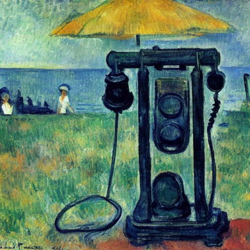

+++
title = 'Wrong Number'
date = 2008-07-05T21:27:24-05:00
draft = false
+++

The time was exactly 11 PM when the phone rang. Its shrill ring filled the house and I rushed and picked up the receiver before mom and dad could wake up.

"Hello?" My voice was very sleepy.
"Hello. Can I speak to Mr. Anantharaman? I'm his friend Rajan speaking."
"I'm sorry. It is the wrong number." I replied, camouflaging my irritation as far as possible.
"Oh I am sorry. Please forgive me."

I slammed down the receiver and went back to my bed again. I was wishing Priya had called when I attended the call, because we had had quite a bit of an argument earlier in the night. But it was not to be so. I cursed the caller, and went off to sleep, wishing there were no more wrong calls. How wrong I was!

There were four more calls in the next half hour, from different persons. All of them wanting the same person, one Mr.Anantharaman. My sleep had completely evaporated by then, and couldn't sleep properly that night. And it didn't stop there.

The calls kept coming everyday. The next couple of weeks were pure torture, as persons ranging from movie actors to politicians to police commissioners wanted to talk to Anantharaman, whoever the hell he was. I learnt that he was a big-shot chartered accountant, and people who were calling were all his clients. I even came to know what his family members' names were. Because there were calls for them too.

One fine Sunday, I was expecting a phone call from one of my friends who had written IELTS and was waiting for his results. When the phone rang, I rushed to pick it up.

"Hello?"
"Hello. Can I speak to Mr. Anantharaman?" a coarse voice came from the other end.
I was at my wits' end. I really wanted to put an end to this.
"I'm sorry, he passed away." I replied in a sad tone.
"What? When? How? I spoke to him only last month, and he was very fine then!"
"He had an accident. His car got smashed by a lorry." I let my imagination run wild.
"Oh that's bad. I'm so sorry."

I ended the call, and immediately after I had kept the receiver down, my friend called. He had got a good score in IELTS and I was very happy for him. We decided to spend the day in Spencer's plaza to celebrate. I called up Priya and asked her to come too. We decided to meet up at 11 AM, and I went to get ready for leaving.

The whole day was spent there, and we had great fun. By the time I came home, it was almost 8. I switched on the TV. The 8 o clock news was running on Sun TV. I decided to while away time by watching it, as I had nothing else to do. There was some news about the Afghanistan war, and the conflict in Gaza. The next news came as a shock to me. Unbelievable.

>In a gruesome accident in the outskirts of Chennai today morning, well-known chartered accountant Mr. Anantharaman was killed when his car got smashed by a lorry. He is survied by his wife and two sons.